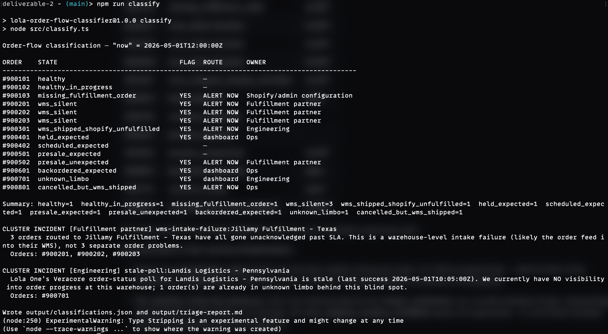

## Deliverable 2 - Fixture-Based Order-Flow Analysis

**Scope:** A small TypeScript classifier that reads **fixtures/order-flow-cases.json**, classifies each order's state, and separates real incidents (someone gets paged) from expected exceptions (visible on a dashboard, nobody paged).

**How to run:**

1. npm install
2. npm run classify

**Project Layout:** 

|                                    |                                                       |
| ---------------------------------- | ----------------------------------------------------- |
| **fixtures/order-flow-cases.json** | provided fixture (unmodified)                         |
| **src/types.ts**                   | fixture + report type definitions                     |
| **src/classify.ts**                | classifier rules, cluster detection, report rendering |
| **output/**                        | generated on each run                                 |

                		

**Outputs:**

- **console.log** — one-line-per-order summary table plus cluster incidents.

-
- **output/classifications.json** — full structured report (per-order state, reason, stale/inconsistent system, owner, next action, alert routing, notes, plus cluster incidents and assumptions). This is the shape a dashboard or alerter would consume.
- **output/triage-report.md** — the same content written in plain English for non-technical owners, grouped into: system-level incidents, alert-immediately orders, dashboard-only exceptions, and healthy orders.

  

**Assumptions:** 

- **eneratedAt** is "now"; all ages and SLA breaches are measured against it.
- Any veracore-sourced lifecycle event counts as WMS acknowledgement — including backordered, since the warehouse has clearly seen the order even if it can't ship it.
- **orders.createdAt** is the "paid" timestamp for the paid→fulfillment-order SLA (matches the paid lifecycle event throughout this fixture).
- A stale warehouse poll means we treat waiting orders as unverified (**unknown_limbo**), never as proven **wms_silent**. Monitoring blind spots are Engineering incidents; warehouse silence is a Fulfillment-partner incident.
- More than 2 **wms_silent** orders at one warehouse collapse into a single cluster incident.
- Expected exceptions (holds, backorders, scheduled, presale-in-window) are dashboard-only, with aging notes for escalation (e.g. holds >24h, backorders >48h without an ETA).
- **shopifyFulfillmentSync:** healthy in **systemHealth** means a WMS-shipped-but-Shopify-unfulfilled order is an order-level failure sent to engineering, not a global sync outage.
- Presale orders only breach after **presaleReleaseAt + presaleShipGraceHours** with nothing shipped; the latest release date on the order governs.

  

**Judgement Calls:** 

- Silence vs blindness (orders #900201–03 vs #900701). Three orders at Jillamy TX are unacknowledged past SLA while our Jillamy poll is healthy — that silence is *real*, and it's the warehouse's problem. 
- Order #900701 at Landis PA is also unacknowledged past SLA, but our Landis poll has been stale for ~2h — we can't tell whether the warehouse is behind or whether we just can't see. So #900701 is **unknown_limbo**, the page goes to Engineering to fix the poll (not to the fulfillment partner), and the order auto-reclassifies once data flows again. ***Paging a 3PL with no evidence burns trust fast.***
- One incident, not N alerts. The three Jillamy orders share a warehouse and a failure mode, so they're folded into a single cluster incident ("Jillamy intake failure") — one page with three order numbers attached, instead of three pages that make the on-call person diagnose the same root cause three times.

**Results Overview:** 

|            |                                    |           |
| ---------- | ---------------------------------- | --------- |
| **900101** | **healthy**                        |           |
| **900102** | **healthy_in_progress**            |           |
| **900103** | **missing_fulfillment_order**      | **ALERT** |
| **900201** | **wms_silent (cluster)**           | **ALERT** |
| **900202** | **wms_silent (cluster)**           | **ALERT** |
| **900203** | **wms_silent (cluster)**           | **ALERT** |
| **900301** | **wms_shipped_shopify_unfufilled** | **ALERT** |
| **900401** | **held_expected**                  | **dash**  |
| **900402** | **schedule_expected**              |           |
| **900501** | **presale_expected**               |           |
| **900502** | **presale_unexpected**             | **ALERT** |
| **900601** | **backorder_expected**             | **dash**  |
| **900701** | **unknown_limbo**                  | **dash*** |
| **900801** | **cancelled_but_wms_shipped**      | **ALERT** |

\* the stale Landis PA poll behind #900701 raises its own immediate Engineering alert

**Communication to Non-technical Stakeholders:**

- Please see **output/triage-report.md** for the full plain-English writeup per order. It is 100% programmatic — deterministic string templating in **src/classify.ts**. *There is no LLM, no API call, nothing probabilistic anywhere in the pipeline.*  

- **The classifier writes the sentences**. Each rule method builds its own **reason**, **nextAction**, etc. as plain template strings, interpolating values pulled from the fixture. For example, the **wms_shipped_shopify_unfulfilled** reason isn't generated — it's this literal template with the computed lag and SLA dropped in:

     **Reason**:  
     *WMS shipped this order **${humanDuration(lag)}** ago but Shopify still shows it unfulfilled  +*  
      **SLA: ${sla}m)**. The customer has no tracking email and support/reporting see a stuck order.

     So "1h 10m ago" is **humanDuration(minutesBetween(shipped.at, this.now))** doing arithmetic on the timestamps 

- **Why I built it this way (it's a deliberate choice, not a limitation)**
  - **Reproducible** — same fixture in, byte-identical report out, every time. You can diff two runs and trust the difference is real data change, not model drift.
  - **Auditable** — every sentence traces to a specific line in a specific rule. When an owner asks "why did this say alert immediately?", the answer is a code path, not "the model felt strongly."
  - **No hallucination risk** — an LLM writing alert text could invent a tracking number or misstate which system is at fault. Here the text can only say what the rule computed.
  - **Free and instant** — no API latency or cost in the hot path of an alerting system.

- **Where an LLM could legitimately add value later — an optional enhancement, not a core dependency —** is a thin presentation layer on top: e.g. taking the deterministic classifications.json and drafting a customer-facing apology email for a presale_unexpected order, or summarizing a 200-incident day into a paragraph for a standup. 

  
